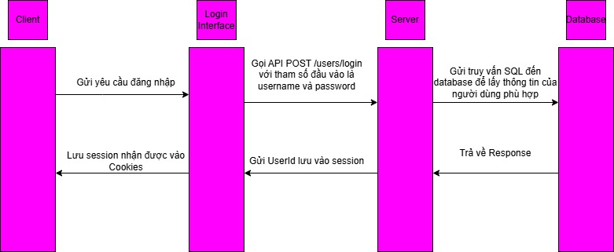
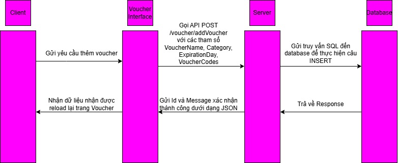

# VoucherHub – Website mua bán trao đổi Voucher

[](https://www.voucherhub.id.vn)
[](#)
[](#)
[](#)

VoucherHub là nền tảng web cho phép người dùng **mua bán, trao đổi các loại voucher** một cách tiện lợi và minh bạch. Hệ thống hỗ trợ đăng bài bán voucher, duyệt giao dịch, hoàn tiền, và gợi ý voucher phù hợp theo nhu cầu người dùng.

Link truy cập website: [https://www.voucherhub.id.vn](https://www.voucherhub.id.vn)

---

## Tính năng chính

- Đăng bài bán voucher: Người dùng có thể thêm và rao bán voucher của mình.
- Mua voucher: Xem và mua các voucher đã được đăng bởi người khác.
- Yêu cầu hoàn tiền: Hỗ trợ gửi yêu cầu hoàn tiền trong các giao dịch.
- Lịch sử giao dịch: Theo dõi tất cả giao dịch đã thực hiện.
- Gợi ý thông minh: Gợi ý bài đăng phù hợp với người dùng dựa trên lịch sử hoặc sở thích.

---

## Công nghệ sử dụng

| Phần     | Công nghệ            |
|----------|----------------------|
| Frontend | ReactJS              |
| Backend  | Node.js              |
| Database | MySQL                |

---

## Cách cài đặt và chạy dự án

### Cấu trúc repo
Repo bao gồm hai phần chính:
client/ (Frontend - ReactJS)
server/ (Backend - NodeJS)

### Chạy frontend (ReactJS)
```bash
cd FrontEnd
npm install
npm run dev

```
Truy cập tại: http://localhost:5173
### Chạy BackEnd (NodeJS)
```bash
cd server
npm install
npm start
```
Backend chạy tại: http://localhost:3000
### 1. Cấu trúc cơ sở dữ liệu (Database Schema)

### Luồng hoạt động chính

Dưới đây là các luồng chức năng chính trong hệ thống VoucherHub:

#### 1. Luồng Đăng ký / Đăng nhập
- Người dùng truy cập trang đăng ký hoặc đăng nhập.
- Gửi các thông tin đăng nhập (username, password), hoặc đăng ký (username, fullname, password, email, phonenumber)
- BackEnd gửi SQL Script về database thực thi
- Database gửi response về BackEnd.
- BackEnd tạo dựa vào ID hoặc UserId được database gửi về để tạo SessionId
- FrontEnd dựa vào SessionId này để tạo Cookies



### 2. Luồng đăng Voucher
- Client gửi các thông tin như Tên Voucher, Loại Voucher, Ngày Hết hạn, Mã Voucher về cho Server
- Server gọi API /voucher/addVoucher với các trường Authorization và application/json với các thông tin vừa nhận được
- Server gửi SQL Script về cho database thực hiện câu INSERT INTO
- Database gửi Response
- Server gửi Id xác nhận thành công
- Client cập nhật lại trang Voucher


### 3. Luồng mua Voucher
 Luồng thanh toán bằng số dư tài khoản

  - Client gửi các thông tin như  cartItems (VoucherId, PostId, Amount, Quantity, UserIdSeller) về cho Server
  - Server gọi API /trade/createCartTransaction  với các trường Authorization và application/json với các thông tin vừa nhận được
  - Server xác thực session người dùng và kiểm tra cartItems là mảng không rỗng
  - Server chuyển cartItems thành JSON string và lấy UserIdBuyer từ session
  - Server gọi Stored Procedure fn_create_cart_transaction(cartData, UserIdBuyer)
  - Database gửi Response với Message và LastTransactionId hoặc error
  - Server gửi LastTransactionId  xác nhận thành công hoặc thông báo lỗi
  - Client cập nhật lại trang thanh toán

 Luồng thanh toán bằng MoMo

  - Client gửi các thông tin như  cartItems (VoucherId, PostId, Amount, Quantity, UserIdSeller) về cho Server
  - Server gọi API /payment/momo/create-payment-voucher với các trường Authorization và application/json với các thông tin vừa nhận được
  - erver xác thực cartData, userIdBuyer, kiểm tra thông tin voucher/post (số lượng, giá) và tính totalAmount. Tạo extraData chứa cartData và userIdBuyer.
  - Gọi MomoPaymentController để tạo requestBody MoMo với totalAmount, orderInfo, extraData và gửi yêu cầu đến MoMo API. Server trả về payUrl từ MoMo cho Client.
  - MoMo xử lý giao dịch.
  - Redirect: Chuyển hướng trình duyệt người dùng về /momo/redirect/voucher. Server xử lý và chuyển hướng Client về trang thông báo/hồ sơ.
  - IPN (quan trọng): Gửi thông báo POST không đồng bộ đến /momo/ipn. Server xác minh IPN, kiểm tra resultCode (thành công = 0).
  - Server gọi Stored Procedure fn_create_momo_cart_transaction(in_cart_data, in_UserIdBuyer)
  - Database gửi Response với Message và LastTransactionId hoặc error
  - Server gửi HTTP 204 No Content về MoMo để xác nhận đã xử lý IPN.
  - Cập nhật trạng thái trang (thông báo thành công/lỗi) và chuyển hướng người dùng dựa trên phản hồi redirect hoặc kết quả IPN.


### 4. Luồng đăng bài
----- Quốc -------------
Luồng Đăng bài

  - Người dùng sau khi đăng nhập, gửi POST request đến endpoint /posting/createPosting với dữ liệu bao gồm VoucherId, Postname, Content và JWT token trong header authorization PostingController.
  - Request được định tuyến qua BackEnd/routes/posting.js posting.js:12 , trước tiên phải qua middleware xác thực posting.js.
  - Phương thức CreatePosting của PostingController sẽ thực hiện 3 bước cơ bản:
    1. Kiểm tra Authorization: thông qua kiểm tra sự tồn tại JWT token và xác thực bằng cách giải mã token để lấy UserId trong PostingController.js    
    2. Validation data: Kiểm tra các trường bắt buộc gồm VoucherId, Postname, Content
    3. Gọi procedure fn_create_post thực thi với các tham số đã validate từ bước 2.
  - Procedure fn_create_post nhận các tham số đầu vào từ các trường từ middleware, sau đó thực hiện chức năng insert bài đăng mới vào bảng Post với ngày đăng là ngay thời điểm tạo, trạng thái mặc định là active, đồng thời trả về thông báo thành công kèm ID của post vừa tạo.
  - Controller trả kết quả từ procedure cho client hoặc thông báo lỗi nếu có exception.

Luồng thông báo (notification)

  - Trang notification được khởi tạo trong component Notification.jsx, sử dụng React hooks để quản lý trạng thái (state).
  - Khi component mount, useEffect tự động gọi hàm fetchNotifications để thực hiện GET request đến endpoint của notification: http://localhost:3000/notification .
  - Request được định tuyến qua hệ thống routing backend. Endpoint /notification được đăng ký trong main router index.js.
  - Trong notification router, route gốc / được map đến method Get20LastestNotifications trong notification.js.
  - NotificationController xử lý request thông qua method Get20LastestNotifications NotificationController.js:27-38 . Controller thực thi stored procedure fn_get_20_lastest_notifications() và trả về kết quả.
  - Sau khi nhận response thành công, frontend cập nhật state và render danh sách notification Notification.jsx:28-33 . Mỗi notification hiển thị title, content và timestamp.
### 5. Luồng yêu cầu hoàn tiền
-------- Khôi Lê ----------


### Giao diện trang chủ


## Kết luận

VoucherHub là nền tảng giao dịch voucher trực tuyến được phát triển với mục tiêu tạo ra một hệ sinh thái an toàn, minh bạch và thuận tiện cho người dùng trao đổi mã giảm giá. Với kiến trúc tách biệt Frontend (ReactJS) và Backend (NodeJS), cùng hệ quản trị cơ sở dữ liệu MySQL, hệ thống đảm bảo tính mở rộng, dễ bảo trì và hiệu suất cao.

Các tính năng cốt lõi như đăng bài, mua voucher, quản lý giao dịch, yêu cầu hoàn tiền và gợi ý thông minh giúp người dùng có trải nghiệm đầy đủ từ A-Z trong quy trình mua bán voucher.

---

## Hướng phát triển trong tương lai

Trong các giai đoạn tiếp theo, nhóm định hướng mở rộng hệ thống theo các hướng sau:

- **Tăng cường bảo mật:**
  - Áp dụng xác thực 2 lớp (2FA)
  - Mã hóa dữ liệu nhạy cảm và log hành vi người dùng đáng ngờ

- **Phát triển ứng dụng di động:**
  - Xây dựng ứng dụng di động sử dụng React Native để phục vụ người dùng trên cả iOS và Android

- **Ứng dụng AI và machine learning:**
  - Gợi ý bài đăng tốt hơn dựa trên lịch sử hành vi
  - Phân tích xu hướng mua bán voucher theo thời gian thực

- **Tích hợp cổng thanh toán đa dạng:**
  - Thêm các cổng thanh toán như ZaloPay, VNPAY,...

- **Tính năng chat giữa người mua và người bán:**
  - Tạo kênh liên lạc trực tiếp, tăng mức độ tin tưởng giữa hai bên

- **Trang quản trị nâng cao cho admin:**
  - Thống kê giao dịch, quản lý người dùng, kiểm duyệt bài đăng hiệu quả hơn

---

> Cảm ơn bạn đã quan tâm đến dự án VoucherHub! Mọi góp ý hoặc đóng góp đều được chào đón

## Bảng phân chia công việc

| Thành viên                | MSSV     | Công việc cụ thể |
|---------------------------|----------|------------------|
| Trưởng nhóm              | [MSSV]   | - Thiết kế API, xử lý logic giao dịch, tích hợp MySQL<br>- Quản lý phân công công việc |
| Nguyễn Trần Minh Khôi    | 23520780 | - Xây dựng cấu trúc MVC cho BackEnd<br>- Tạo các bảng quảng cáo ở trang LandingPage, tạo Navbar cơ bản<br>- Tạo trang đăng bài, danh sách các Voucher, tạo bài đăng<br>- Làm các ô bài đăng, phân trang, chia các bài đăng theo Category ở trang Cửa hàng<br>- Call API Momo để cho người dùng nạp tiền vào hệ thống và thanh toán bằng Momo<br>- Làm trang Profile và tính năng chỉnh sửa hồ sơ<br>- Làm tính năng thêm Voucher (Add Voucher) bằng form và bằng Excel <br> - Làm tính năng gợi ý các bài đăng dựa trên Category và Transaction History và call API OpenAI <br> - Làm các tính năng của Admin như quản lý bài đăng, quản lý người dùng, quản lý giao dịch,... |
| Phạm Tấn Gia Quốc        | 23521308 | - Thiết kế và tối ưu CSDL MySQL<br>- Tạo sơ đồ ERD và xử lý truy vấn SQL |
| [Tên thành viên 4]       | [MSSV]   | - Viết test case<br>- Kiểm tra tính năng như đăng nhập, mua bán, hoàn tiền |


> Ghi chú:
> - Nhóm sử dụng GitHub để quản lý mã nguồn và chia nhánh theo từng chức năng.
> - Phân công công việc được điều chỉnh linh hoạt theo tiến độ thực tế.

