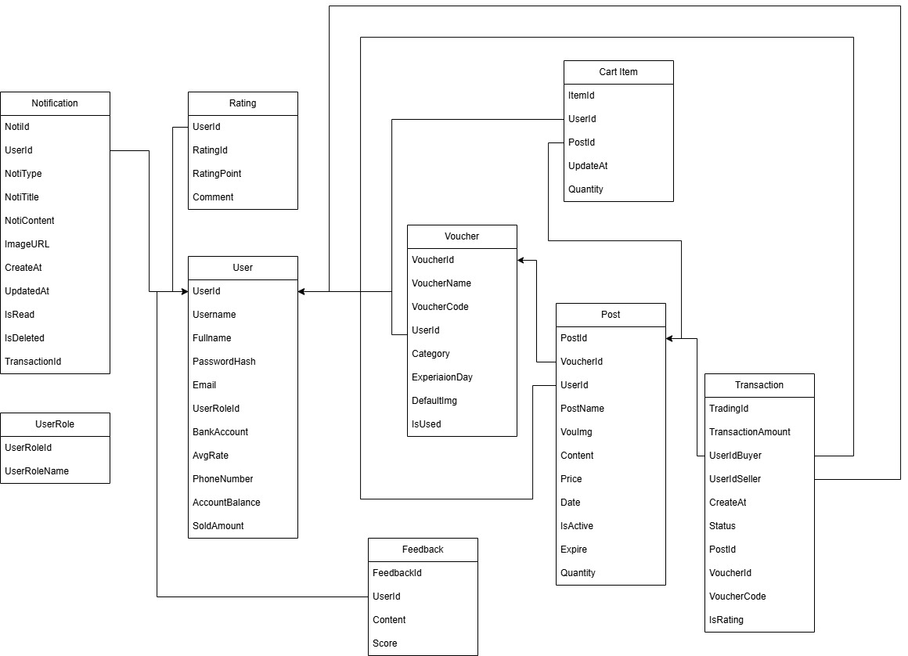
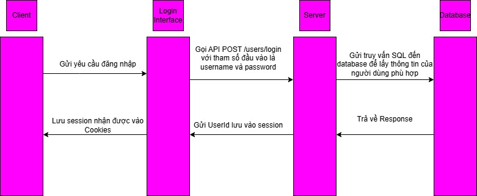
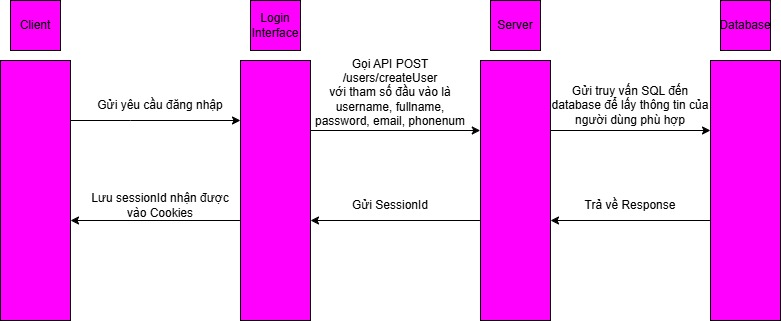
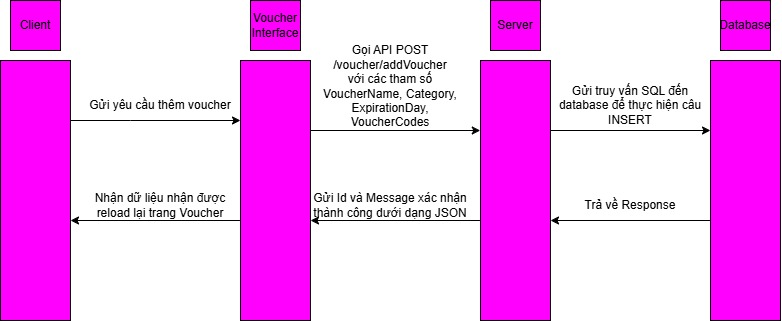
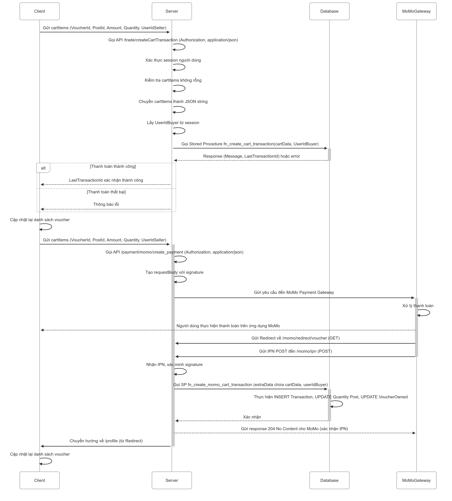

# 🎟️ VoucherHub – Website mua bán trao đổi Voucher

[](https://www.voucherhub.id.vn)
[](#)
[](#)
[](#)

VoucherHub là nền tảng web cho phép người dùng **mua bán, trao đổi các loại voucher** một cách tiện lợi và minh bạch. Hệ thống hỗ trợ đăng bài bán voucher, duyệt giao dịch, hoàn tiền, và gợi ý voucher phù hợp theo nhu cầu người dùng.

🔗 Website chạy tại: [https://www.voucherhub.id.vn](https://www.voucherhub.id.vn)

---

## 🚀 Tính năng chính

- 📤 Đăng bài bán voucher: Người dùng có thể thêm và rao bán voucher của mình.
- 📥 Mua voucher: Xem và mua các voucher đã được đăng bởi người khác.
- 🔁 Yêu cầu hoàn tiền: Hỗ trợ gửi yêu cầu hoàn tiền trong các giao dịch.
- 📜 Lịch sử giao dịch: Theo dõi tất cả giao dịch đã thực hiện.
- 💡 Gợi ý thông minh: Gợi ý bài đăng phù hợp với người dùng dựa trên lịch sử hoặc sở thích.

---

## 🛠️ Công nghệ sử dụng

| Phần     | Công nghệ            |
|----------|----------------------|
| Frontend | ReactJS              |
| Backend  | Node.js              |
| Database | MySQL                |

---

## ⚙️ Cách cài đặt và chạy dự án

### 📁 Cấu trúc repo
Repo bao gồm hai phần chính:
client/ (Frontend - ReactJS)
server/ (Backend - NodeJS)

### 🖥️ Chạy frontend (ReactJS)
```bash
cd FrontEnd
npm install
npm run dev

```
Truy cập tại: http://localhost:5173
### 🖥️ Chạy BackEnd (NodeJS)
```bash
cd server
npm install
npm start
```
Backend chạy tại: http://localhost:3000
### 1. 🗂️ Cấu trúc cơ sở dữ liệu (Database Schema)

### 🔄 Luồng hoạt động chính

Dưới đây là các luồng chức năng chính trong hệ thống VoucherHub:

#### 🔐 1. Luồng Đăng ký / Đăng nhập
- Người dùng truy cập trang đăng ký hoặc đăng nhập.
- Gửi các thông tin đăng nhập (username, password), hoặc đăng ký (username, fullname, password, email, phonenumber)
- BackEnd gửi SQL Script về database thực thi
- Database gửi response về BackEnd.
- BackEnd tạo dựa vào ID hoặc UserId được database gửi về để tạo SessionId
- FrontEnd dựa vào SessionId này để tạo Cookies



### 2. Luồng đăng Voucher
- Client gửi các thông tin như Tên Voucher, Loại Voucher, Ngày Hết hạn, Mã Voucher về cho Server
- Server gọi API /voucher/addVoucher với các trường Authorization và application/json với các thông tin vừa nhận được
- Server gửi SQL Script về cho database thực hiện câu INSERT INTO
- Database gửi Response
- Server gửi Id xác nhận thành công
- Client cập nhật lại trang Voucher


### 3. Luồng mua Voucher
 Luồng thanh toán bằng số dư tài khoản

  - Client gửi các thông tin như VoucherId, Quantity, TotalAmount về cho Server
  - Server gọi API /trade/paymentbybalance với các trường Authorization và application/json với các thông tin vừa nhận được
  - Server xác thực session người dùng và kiểm tra VoucherId hợp lệ
  - Server gọi Stored Procedure fn_payment_by_userbalance(UserId, VoucherId)
  - Server gửi SQL Script về cho database thực hiện câu kiểm tra số dư và UPDATE giao dịch
  - Database gửi Response với out_message và out_id
  - Server gửi TransactionId xác nhận thành công hoặc thông báo lỗi
  - Client cập nhật lại trang thanh toán và chuyển hướng đến /profile

 Luồng thanh toán bằng MoMo

  - Client gửi các thông tin như VoucherId, Amount, OrderInfo về cho Server
  - Server gọi API /payment/momo/create_payment với các trường Authorization và application/json với các thông tin vừa nhận được
  - Server tạo requestBody với signature và gửi yêu cầu đến MoMo Payment Gateway
  - MoMo Gateway xử lý thanh toán và người dùng thực hiện thanh toán trên ứng dụng MoMo
  - MoMo gửi Redirect về /momo/redirect/voucher và IPN POST đến /momo/ipn
  - Server nhận IPN, xác minh signature và gọi SP fn_create_momo_cart_transaction
  - Database thực hiện INSERT Transaction, UPDATE Quantity Post, UPDATE VoucherOwned
  - Server gửi response 204 No Content cho MoMo để xác nhận đã nhận IPN
  - Client được chuyển hướng về /profile và cập nhật lại danh sách voucher


### 4. Luồng đăng bài
----- Quốc -------------


### 5. Luồng yêu cầu hoàn tiền
-------- Khôi Lê ----------


### 🖥️ Giao diện trang chủ


## ✅ Kết luận

VoucherHub là nền tảng giao dịch voucher trực tuyến được phát triển với mục tiêu tạo ra một hệ sinh thái an toàn, minh bạch và thuận tiện cho người dùng trao đổi mã giảm giá. Với kiến trúc tách biệt Frontend (ReactJS) và Backend (NodeJS), cùng hệ quản trị cơ sở dữ liệu MySQL, hệ thống đảm bảo tính mở rộng, dễ bảo trì và hiệu suất cao.

Các tính năng cốt lõi như đăng bài, mua voucher, quản lý giao dịch, yêu cầu hoàn tiền và gợi ý thông minh giúp người dùng có trải nghiệm đầy đủ từ A-Z trong quy trình mua bán voucher.

---

## 🚀 Hướng phát triển trong tương lai

Trong các giai đoạn tiếp theo, nhóm định hướng mở rộng hệ thống theo các hướng sau:

- 🔐 **Tăng cường bảo mật:**
  - Áp dụng xác thực 2 lớp (2FA)
  - Mã hóa dữ liệu nhạy cảm và log hành vi người dùng đáng ngờ

- 📱 **Phát triển ứng dụng di động:**
  - Xây dựng ứng dụng di động sử dụng React Native để phục vụ người dùng trên cả iOS và Android

- 🤖 **Ứng dụng AI và machine learning:**
  - Gợi ý bài đăng tốt hơn dựa trên lịch sử hành vi
  - Phân tích xu hướng mua bán voucher theo thời gian thực

- 🌐 **Tích hợp cổng thanh toán đa dạng:**
  - Thêm các cổng thanh toán như ZaloPay, VNPAY,...

- 💬 **Tính năng chat giữa người mua và người bán:**
  - Tạo kênh liên lạc trực tiếp, tăng mức độ tin tưởng giữa hai bên

- 📊 **Trang quản trị nâng cao cho admin:**
  - Thống kê giao dịch, quản lý người dùng, kiểm duyệt bài đăng hiệu quả hơn

---

> Cảm ơn bạn đã quan tâm đến dự án VoucherHub! Mọi góp ý hoặc đóng góp đều được chào đón 🙌

## 📋 Bảng phân chia công việc

| Thành viên                | MSSV     | Công việc cụ thể |
|---------------------------|----------|------------------|
| Trưởng nhóm              | [MSSV]   | - Thiết kế API, xử lý logic giao dịch, tích hợp MySQL<br>- Quản lý phân công công việc |
| Nguyễn Trần Minh Khôi    | 23520780 | - Xây dựng cấu trúc MVC cho BackEnd<br>- Tạo các bảng quảng cáo ở trang LandingPage, tạo Navbar cơ bản<br>- Tạo trang đăng bài, danh sách các Voucher, tạo bài đăng<br>- Làm các ô bài đăng, phân trang, chia các bài đăng theo Category ở trang Cửa hàng<br>- Call API Momo để cho người dùng nạp tiền vào hệ thống và thanh toán bằng Momo<br>- Làm trang Profile và tính năng chỉnh sửa hồ sơ<br>- Làm tính năng thêm Voucher (Add Voucher) bằng form và bằng Excel <br> - Làm tính năng gợi ý các bài đăng dựa trên Category và Transaction History và call API OpenAI <br> - Làm các tính năng của Admin như quản lý bài đăng, quản lý người dùng, quản lý giao dịch,... |
| [Tên thành viên 3]       | [MSSV]   | - Thiết kế và tối ưu CSDL MySQL<br>- Tạo sơ đồ ERD và xử lý truy vấn SQL |
| [Tên thành viên 4]       | [MSSV]   | - Viết test case<br>- Kiểm tra tính năng như đăng nhập, mua bán, hoàn tiền |


> 📌 Ghi chú:
> - Nhóm sử dụng GitHub để quản lý mã nguồn và chia nhánh theo từng chức năng.
> - Phân công công việc được điều chỉnh linh hoạt theo tiến độ thực tế.

